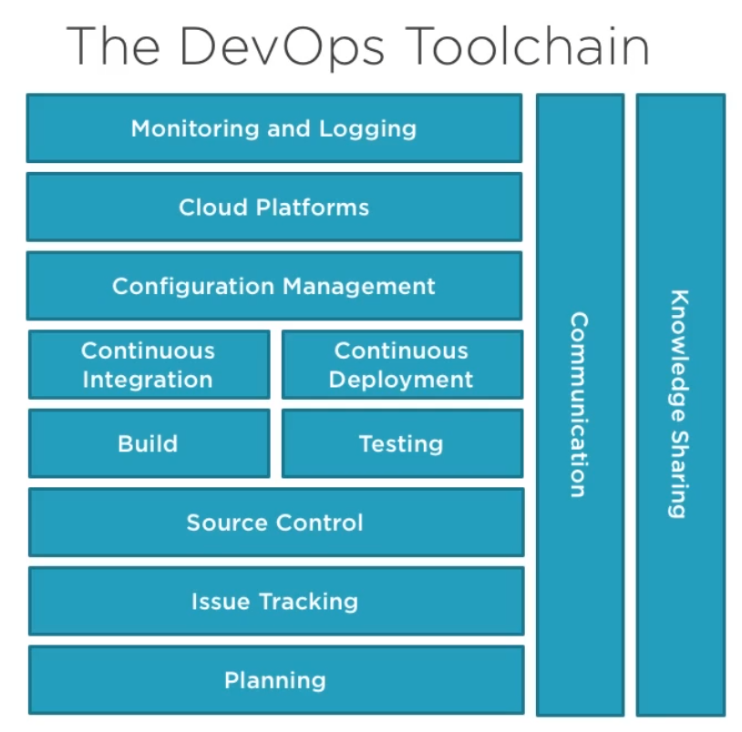

# DevOps: The Big Picture
Study notes from Richard Seroter's course at https://app.pluralsight.com/library/courses/devops-big-picture

## Problems DevOps solves

 * Simplify and automate deployment timelines. Complicated timelines involve:
   
   * Many handoffs
   * Numerous Teams involved
   * Manual intervention
   * Downtime expected

### Pain points
  * Serious outages

    * Panic when systems go offline.
    * Repeat instances of the same mistakes as heroes step in to fix it
    * Slow recovery is the norm. Not enough telemetry to quickly understand which components are working or failing
    * Low faith in IT. Lack of trust from users and infighting within the IT team throwing blame

  * No incremental value
    
    * Lengthy projects with lots of upfront work
    * Infrequent, big-bang releases of large batches
    * No experimentation happening as cannot quickly test
    * Line of Business look elsewhere for innovation

  * Excessive infighting
    
    * Us vs them with little transparency. Both inside IT and between IT and other Organisational Units
    * IT Teams have their own incentives that don't neccisarily align to business requirements
    * Lack of customer focus
    * Losing talented people because of bad culture

### Waste
Anything that takes time but doesn't add value for the customer

  * Knowledge Waste

    * Caused by disrupting the flow of knowledge
    * Caused by the disruption of the absorbtion of knowledge
    * Example: Physical barriers or overly complex reports

  * Waiting Waste / Bottlenecking
    * Often caused by uneven processing
    * Can occur with highly specialised personnel
    * Example: Waiting for environments or approvals before deploying

  * Over-Processing Waste
    
    * This is about doing more work than is required or needed
    * Can address by actually knowing requirements
    * Example: Over-engineering software or too-long design specs

  * Motion Waste

    * Unnessary movement by people or machines
    * May fix by physically rearranging, or updating tech
    * Example: Double entry of data or repetitive manual testing

  * Transporation Waste

    * This is about moving this without adding value
    * Impacts waiting waste and may be done because "we've always done it that way"
    * Example: Sending rubber stamped approval docs among executives

  * Correction Waste
    
    * Product isn't usable and rework is required
    * Often happens when quality is not built in to the process
    * Example: having a software "testing" as a distinct phase in the Software Development Life Cycle

  * Inventory Waste

    * Things are piling up and not realising value
    * Causes lumpy processing and bunches up hidden problems
    * Example: Completed code waiting to be deployed

  * Over-Production Waste

    * This happens when you produce more than necessary
    * Sometimes done to keep staff or machines busy
    * Example: Creating test environments for each team

### Introducing DevOps

What do you want to accomplish?
  1. Increase the value given to customers
  2. Respect your people

What is Lean all about?
  * Focuses on customer value by freeing up resources
  * Eliminate waste. Eliminate all non value-add processess
  * One-piece flow. Single unit batch flow
  * Shared, continuous learning. Not a single expert, but train everyone
  * Eliminate overburden of people and equipment
  * Theory of constraints. Find bottlenecks, recognise them as constraints and remove them. 

  CALMS:

    C. Culture: People and process at the forefront
    A. Automation: Repeatability by automating activities
    L: Lean: Applying Lean principals to IT. Make work visible, reduce batch sizes etc
    M: Metrics: Measure extensively and use to improve
    S: Sharing: Continuous learning by sharing knowledge

Does Devops matter? Elite performers are winning.

Source: 2018 Accelerate State of DevOps Report
  * 2604x faster time to recover from incidents
  * 46x more frequent code deployments
  * 1.53x more likely to meet or exceed business goals
  * 1.8x more likely to recommend their team to others

## Making a DevOps Transition

### Changing the culture

#### Start with Why
  * What are your shared objectives?
  * Does everyone empathise with the customer? Do they know who they're serving and why?
  * Are you going through the agile motions? Or doing it properly
  * Misalignment will doom your effort. Things like valuing dates over quality, treating staff as replaceable and silo success over customer success

#### Empowerment
  * Trust the team, let them take ownership
  * Employees do whats needed to run the service
  * Anyone can "pull the cord" - if somethings going wrong, anyone can halt process or production to raise a concern or an incident
  * Teams form during crisis to resolve issues

#### Accountability
  * Can't have empowerment without accountability
  * Quality built into the process. Everyone is accountable for the service
  * Shared commitment to excellence. All in this together, and a social response to call out bad form. Team has shared responsibilty for delivering something great
  * Reward who deliver and take responsibility
  
#### Teamwork
  * All disciplines working together, in crisis or daily operations
  * Respect unique skill sets
  * Find excuses to get the teams together. Brown bags to demonstrate features, socialise etc.
  * Don't reward the "lone genius", "hero" or firefighter

#### Learning
  * Offer resources and time to learn. Encourage self study, creating a public profile, engagements and attending conferances 
  * Encourage experimentation
  * Conduct blameless postmortems. Find what broke down in the system and reduce repeated mistakes.
  * Make it easy to share and discover info

Share, live and reward the right values.
  * Don't just say your values, live them
  * What triggers promotions or bonuses?
  * Managers must lead by example

### Changing the organisation

#### Understand your customers, bottlenecks and value streams
Can't automate or optimise what I don't understand
  * Build up and value empathy for users
  * Step back and "see" the systems in place. What are they asking for vs what is delighting them
  * Perform value stream mapping exercises to focus your improvement efforts

Put the spotlight on bottlenecks
  * It's ineffective to optimise anywhere but the constraint. If you don't fix the constraint, you're only piling up move inventory at the constraint input
  * A constraint can be internal (People/Process) or external (Limited demand)
  * Theory of Constraints helps you identify and eliminate these limiting factors

#### Remove Inconsistencies via Automation
  * Applies to different environemtnts (EG: Dev, QA, Staging), but also within each environment
  * Result of the bottleneck? Slower software releases and issue resolution
  * Aim for on-demand environments with no configuration drift

Automate the path to production:
  * How fast can you deploy code? Is inventory piled up?
  * Coding or testing faster won't help you if the deployment process isn't optimised
  * Solution involves continuous integration and comprehensive, automated pipelines

#### Build in Quality and Break down Communication Barriers
  * WA teams aren't responsible for quality. Everyone is responsible.
  * Shared commitment to excellence means testing early and often
  * Achieved through practices like TDD and continuous integration

Break down communication barriers
  * Poor communication restults in push, not pull-based systems
  * Feedback loops are critical to context and shared ownership
  * Solved via a mix of tools, practices, and sincere intent to collaborate

#### Rethink Team Approach / Rebuild Teams
  * IT is historically organised by functional teams
  * The result? Waste, uneven flow and poor visibility of the value stream
  * Smart companies are moving from projects to products. Take a product based mindset over a project based mindset.

#### Alter Team Structure
Create permanent teams around core products
  * Teams don't disband after shipping v1, the build *and run* their service
  * The benefit? Retain knowledge, continuously update services, improve customer satisfaction
  * Not a fit for every product, but puts focus on custoemr value

To achieve velocity, you need complete teams
  * Must be capable of going from idea to production on their own
  * Encourage generalist skill sets versus hyper-specialisation
  * In large organisations, may use services or APIs (vs people) from constrainted teams

#### Eliminate Waste
  * Polices and procedures get heavier over time; return to the intent
  * Automate manual steps wherever possible
  * Technology can help, but improvement here takes a change of focus

### Handling objections
Devops makes us less secure
  * Developers pushing to production? We're focusing on quality and reducing bugs and security issues making it less likely for them to make it into production
  * Shfiting left on security improves your posture, by developing security earlier in development
  * Automation means fewer manual mistakes and faster vulnerability resolution

We have offshore teams
  * Co-location of teams isn't always possible or necessary. 
  * Shared culture, values and incentives are the only requirement
  * Nature of outsourced partnerships has to change. 

You're eliminating our Ops team.
  * Do you fire all the system administrators?
  * Operations is more important, but role changes
  * It's about running platforms, creating API's, delivering pipelines
  * Automate the commodity work and eliminate toil

I've got too much COTS and legacy code.
  * Can you only do DevOps with Fresh, Cloudy systems?
  * TDD, continueous integration, deployment automations possible with legacy environments
  * Remember, the point isn't about pushing code faster, but improving flow

We don't have these skills
  * An investment worth making
  * Many of these are soft skills, better communication, empathy, presentation skills etc.
  * Make it group learning and apply immediately.

## DevOps Automation and toolchain

### About DevOps and Tools
  * The goal is continuous improvement with a focus on efficiency and flow
  * You cannot buy DevOps
  * Tool adoption happens in stages

### DevOps Technology Categories
  
### Devops Technologies: Planning
  * Why it matters to DevOps: Shared purprose, transparency, empowerment
  * Examples
    
    * GitLab
    * TaskTop
    * CollabNet VersionOne
    * Pivotal Tracker
    * Trello
    * Azure Boards

### DevOps Technologies: Issue Tracking
  * Why it matters to DevOps: Customer responsiveness, limited knowledge waste, feedback loop
  * Examples

    * Atlassian Jira
    * *JetBrains YouTrack*
    * ZenDesk

### DevOps Technologies: Source Control
  * Why it matters to DevOps: Asset control, limit transportation waste, empower teams
  * Examples:

    * Git
    * GitHub
    * GitLab
    * Bitbucket
    * Subversion

### DevOps Technologies: Build
  * Why it matters to DevOps: Consistent packaging, automates an error-prone activity, yields early quality signals
  * Examples

    * Maven / Gradle
    * MSBuild
    * Rake
    * JFrog Artifactory
    * Sonatype
    * NuGet

### DevOps Technologies: Test
  * Why it matters to DevOps: Puts the focus on built-in quality, creates confidence in deployed artifacts
  * Examples

    * JUnit
    * XUnit.net
    * Selenium
    * Jasmine
    * Cucumber

### DevOps Technologies: Continuous Integration
  * Why it matters to DevOps: Fast feedrback, reduce defect waste and waiting waste
  * Examples

    * Jenkins
    * CircleCI
    * TravisCI
    * ConCourse
    * AWS CodePipelines
    * Azure Pipelines

### DevOps Technologies: Continuous Deployment
  * Why it matters to DevOps: Limit your pre-prodcution inventory, automate complex pipelines, unify team around getting value to customers
  * Examples

    * Spinnaker
    * Octopus Deploy
    * AWS CodeDeploy

### DevOps Technologies: Configuration Management
  * Why it matters to DevOps: Enforce consistency, treat infrastructure as code
  * Examples

    * Terraform
    * BOSH
    * Chef
    * Ansible
    * Puppet
    * Google Cloud Deployment Manager

### DevOps Technologies: Cloud Platforms
  * Why it matters to DevOps: Automation-friendly, observable runtimes for software
  * Examples:

    * AWS
    * Azure
    * Google Cloud Platform
    * Pivotal Cloud Foundry
    * Heroku
    * Container Schedulers like Kubernates

### DevOps Technologies: Monitoring and Logging
  * Why it matters to DevOps: Fast recovery, responsiveness, transparency, limited human involvement during incidents
  * Examples:

    * ELK Stack
    * Datadog
    * New Relic
    * Prometheus
    * Zipkin
    * Azure Monitor

### DevOps Technologies: Communication
  * Why it matters to DevOps: Connect teams, limit waiting waste, improve collaboration
  * Examples

    * Slack
    * Teams
    * Google Hangouts
    * Zoom

### DevOps Technologies: Knowledge Sharing
  * Why it matters to DevOps: Reduce knowledge waste, increase new-hire productivity, limit repeat mistakes
  * Examples

    * GitHub Pages
    * Confluence
    * Jekyll
    * Google Sites